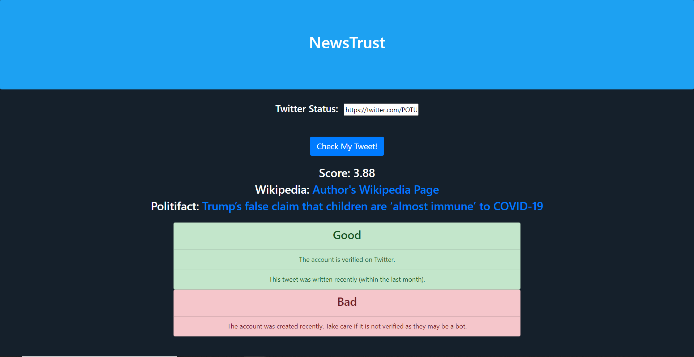
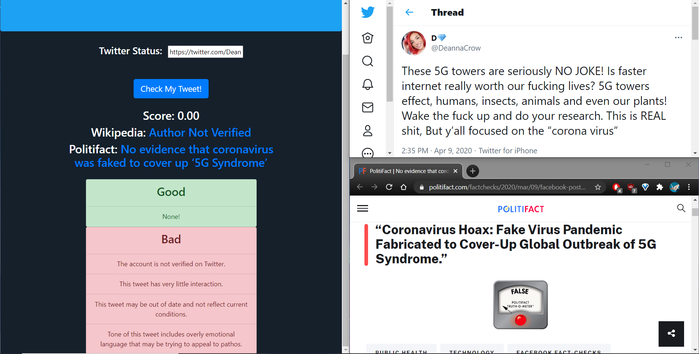

### Winning hack for "Best Use of Google Cloud" at HoyaHacks2021

## Inspiration
A lot of people use Twitter for connecting with friends, following new trends, and sometimes for keeping up with the news. However, sometimes people use Twitter without the intention of only spreading facts. Therefore, there should be a product that can inform users about whether the tweet is trustworthy. 

## What it does
NewsTrust takes in a Twitter status and provides a score on the trustworthiness using 11 different criteria that focus on the metadata of the tweet (whether the user is verified, creation date of account and tweet, etc...) and sentence structure (Complexity of sentences, grammatical correctness  & sentiment analysis) . We then provide cross-validation materials such as links to PolitiFact to verify the facts in tweets. We then describe what significant values in the metrics led to the score (which metrics scored significantly low or high). 

## How we built it

We used the Twitter API to pull user data and then parsed it, creating different metrics and then weighting metrics on both importance and accuracy. We also used the Google Cloud Platform's sentiment analysis to detect how much emotion was used in each tweet. We analyzed the structure of the tweet, taking into account sentence complexity, capitalization usage, and spelling.  We used Flask to create a front-end that plugged into our back-end and made it very similar to Twitter aesthetic. 

Each metric was normalized to 5 points in different ways, for example, we used a Gaussian function to transform the output of the sentiment analysis from the Google Cloud Platform. Normally, the magnitude of sentiment analysis is 0 to infinity, but we wanted to use the Gaussian function to penalize more for additional use of emotional words. Each metric had a unique way to calculate and normalize to a five point scale. We then had to aggregate the values into a singular output. We did this by first rating each metric by importance and confidence. After that, we were able to create weighting that summed up to a 100-point -scale. We used that to create an ultimate output index on a scale from 0 to 5. 

## Challenges we ran into
We spent a lot of time at the start figuring out what kinds of metrics we could possibly use and whether or not we would need additional API's to get such information. We ended up only needing to use the Twitter API and Google Cloud Platform. 

## Accomplishments that we're proud of
We were able to successfully connected our back-end to our front-end, when we previously thought we didn't even have the time for a front-end. 

## What we learned
It was our first time using Flask and we were glad we were still able to apply our HTML/JavaScript skills even when using a new technologyhttps://youtu.be/bKk7R_LulvM. 

## What's next for NewsTrust
Creating a extension that could either provide the rankings of tweets on Twitter itself or filtering out the lower rated tweet entirely. 